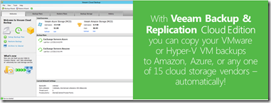
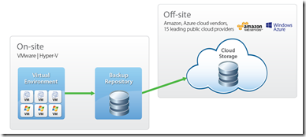

Veeam Backup & Replication Cloud Edition combines all the functionality of Veeam Backup & Replication together with Veeam Cloud Backup — a new component that offers a convenient and easy way to work with the cloud storage. Veeam Cloud Backup will help you to:  
•    Upload Veeam Backup files to the cloud  
•    Restore Veeam Backup files from the cloud  
•    Restore VM guest OS files directly from Veeam Backup files in the cloud

**How it works:**

Veeam Backup & Replication Cloud Edition you can copy your VMware or Hyper-V VM backups to cloud providers. Veeam Backup & Replication Cloud Edition supports over 15 different cloud storage service providers including: Amazon S3, Amazon Glacier, Windows Azure, Google Cloud Storage, OpenStack, Rackspace, DreamObjects and HP Cloud.  You can also use the File System option to copy data to local disks, SAN and NAS.

With Veeam Backup & Replication Cloud Edition, you can rest easy knowing that your backups are safe in the cloud and available 24/7.

Learn more by clicking on the following [link](http://www.veeam.com/cloud-backup-VMware-hyper-v.html?mkt_tok=3RkMMJWWfF9wsRolu6%252FJdu%252FhmjTEU5z17OgtUaG3lMI%252F0ER3fOvrPUfGjI4CTcVjMq%252BNFAAgAZVnyRQFDOWQfY0%253D).

