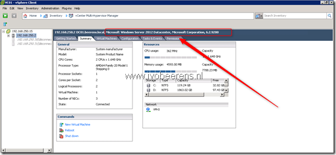
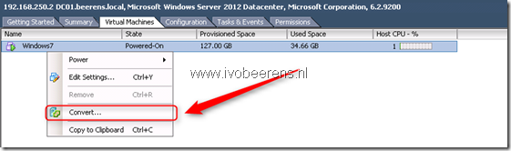

The VMware vCenter Multi-Hypervisor Manager 1.1 is a minor release which introduces the following new capabilities:

- Migration of virtual machines from Hyper-V to ESX or ESXi hosts.
- Support for the latest Microsoft Hyper-V hypervisor (as well as earlier Hyper-V versions).
- Increased scalability with regards to an increased number of supported third-party hosts to 50 (from 20 in vCenter Multi-Hypervisor Manager 1.0).
- Ability to provide custom certificates for the vCenter Multi-Hypervisor Manager server from the installer wizard.
- Multiple objects selection in the UI of the vCenter Multi-Hypervisor Manager plug-in and a number of other usability improvements.
- vCenter Multi-Hypervisor Manager server and client-side bug fixes.

Version 1.1 is now in public beta available and can be obtained from here.

