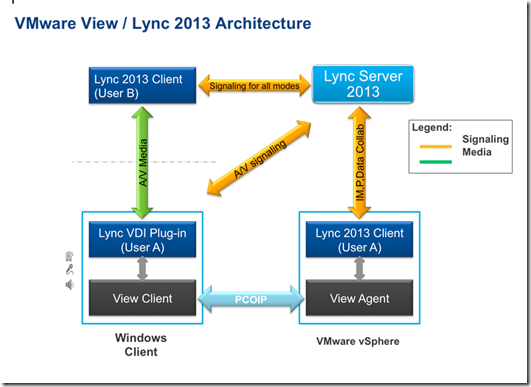

Here is a list of supported features with Lync 2013 in VMware View:

<table border="1" cellspacing="0" cellpadding="0"><tbody><tr><td valign="top" width="151">
<b>Features</b>
</td><td valign="top" width="439">
<b>Support/Unsupported</b>
</td></tr><tr><td valign="top" width="151">
<b>Presence</b>
</td><td valign="top" width="439">
Supported
</td></tr><tr><td valign="top" width="151">
<b>Instant Message</b>
</td><td valign="top" width="439">
Supported
</td></tr><tr><td valign="top" width="151">
<b>Desktop Sharing</b>
</td><td valign="top" width="439">
Supported
</td></tr><tr><td valign="top" width="151">
<b>Application Sharing</b>
</td><td valign="top" width="439">
Supported
</td></tr><tr><td valign="top" width="151">
<b>PowerPoint Sharing</b>
</td><td valign="top" width="439">
Supported
</td></tr><tr><td valign="top" width="151">
<b>Whiteboards</b>
</td><td valign="top" width="439">
Supported
</td></tr><tr><td valign="top" width="151">
<b>File transfer</b>
</td><td valign="top" width="439">
Supported
</td></tr><tr><td valign="top" width="151">
<b>Online meetings</b>
</td><td valign="top" width="439">
Supported
</td></tr><tr><td valign="top" width="151">
<b>Office Integration</b>
</td><td valign="top" width="439">
Supported
</td></tr><tr><td valign="top" width="151">
<b>Audio</b>
</td><td valign="top" width="439">
Supported (with Lync 2010, this used to only be supported via IP-Phone)
</td></tr><tr><td valign="top" width="151">
<b>Video</b>
</td><td valign="top" width="439">
Supported (with Lync 2010, this was never supported)
</td></tr><tr><td valign="top" width="151">
<b>Recording audio</b>
</td><td valign="top" width="439">
Unsupported
</td></tr></tbody></table>

All the media processing is offloaded from the datacenter to the client endpoint. The following diagram highlights the different components and the communication flow of the VMware View and Microsoft Lync 2013:

The VDI Plug-in is a standalone application that needs the be installed on the local Windows computer and allows the use of local audio and video devices with the Lync 2013 client running in the View Desktop. Audio and Video traffic is sent point-to-point between the endpoints.

On the moment only Windows 7  SP1 is supported as client OS and View desktop.

VMware has released a guide about the installation and configuration of Lync 2013 with VMware View 5.2. The document can be found [here](http://communities.VMware.com/servlet/JiveServlet/downloadBody/22775-102-1-30309/VMwareViewandMicrosoftLync2013InstallationGuidev1.0.doc)

