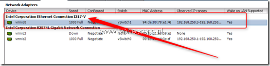

- Inject the driver in the ESXi ISO using for example the “ESXi-Customizer” tool. See my blogpost  “[VMware ESXi 5 whitebox NIC support](https://www.ivobeerens.nl/?s=ESXi+Customizer)” for more information.
- Install the driver when ESXI is already installed. You need a supported network card to be able to install ESXi!

Here is a quick overview how to install the driver when ESXI is already installed:

- Download the driver
- Upload the VIB to a datastore by using the vSphere Client
- Start the SSH service on the ESXI server and make a SSH connection to the ESXi server
- Put the ESXi server in maintenance mode, command: esxcli  system maintenanceMode set -e true
- Change the ESXi host acceptance level to Community Supported, command: esxcli software acceptance set --level=CommunitySupported
- Install the VIB, command:  esxcli software vib install -v /vmfs/volumes/datastore1/net-e1000e-2.3.2.x86\_64.vib
- Reboot the system after the following message “Message: The update completed successfully, but the system needs to be reboot“,command: reboot
- When the ESXi host is up make a SSH connection and exit maintenance mode. Command: esxcli  system maintenanceMode set -e false

Check if the Intel I217-V network adapter is visible is the vSphere Client or vSphere Web client

