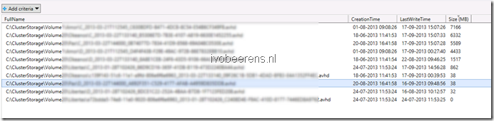

- Location of the snapshot file
- Date and time that the snapshot file was created
- Last write access time of the snapshot file
- File size in MBs

The PowerShell one-liner is executed from a Hyper-V 2012 host that has access to all the  Cluster Shared Volumes (CSVs). \[code language="PowerShell"\]Get-ChildItem C:\\ClusterStorage\\ \* -include \*.avhd -recurse | Select-Object Fullname,CreationTime,LastWriteTime,@{"Name"="Size (MB)"; "Expression"={\[int\]($\_.Length/1mb)}} | Out-GridView \[/code\] This PowerShell one-liner produces the following output: 

