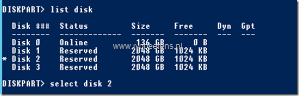
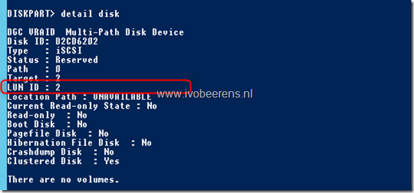

- **View the disks**

list disk

- **Select a disk**

select disk _<number>_

- **View the LUN ID of the disk**

detail disk

I didn’t find a PowerShell command to view the LUN IDs. You can create a PowerShell script that uses Diskpart to view all the disks and the corresponding LUN IDs.

