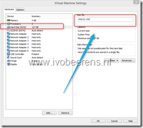
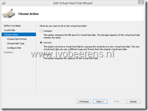
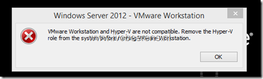

<table border="0" width="400" cellspacing="0" cellpadding="2"><tbody><tr><td valign="top" width="200"></td><td valign="top" width="200"></td></tr><tr><td valign="top" width="200">1. VHD disk</td><td valign="top" width="200">2. Convert options in Hyper-V</td></tr></tbody></table>

That’s why I use Hyper-V on my laptop sometimes. When trying to start VMware Workstation the following error appears:

> VMware Workstation and Hyper-V are not compatible. Remove the Hyper-V role from the system before running VMware Workstation.

This is because the Hyper-V role is installed and this conflicts with VMware Workstation. To disable Hyper-V from starting the following command can be used:

bcdedit /set hypervisorlaunchtype off

A reboot of of the Windows OS is necessary.

To enable the Hyper-V role again use the following command:

bcdedit /set hypervisorlaunchtype auto

A reboot of of the Windows OS is necessary.

