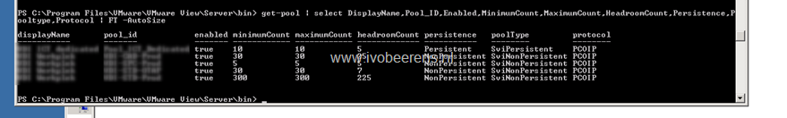

Here are some examples to use:

Display all the pools and settings:

get-pool

Display the pools with selected fields in table form:

Get-pool | select DisplayName,Pool\_ID,Enabled,MinimumCount,MaximumCount,HeadroomCount,Persistence,Pooltype,Protocol | FT -AutoSize

Display the some fields in table form and export the pool information to a a text file:

get-pool | select DisplayName,Pool\_ID,Enabled,MinimumCount,MaximumCount,HeadroomCount,Persistence,Pooltype,Protocol | FT -AutoSize | out-file c:\\temp\\pools.txt

The get-pool commands does not export all the settings that can be provided in a VMware View pool.

