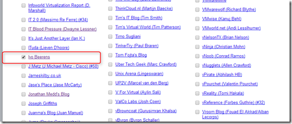

> - ****Longevity**** - Anyone can start a blog but it requires dedication, time & effort to keep it going. Some bloggers start a blog only to have it fall to the wayside several months later. Things always come up in life but the good bloggers keep going regardless of what is happening in their life.
> - ****Length**** - It’s easy to make a quick blog post without much content, nothing wrong with this as long as you have good content in the post that people will enjoy. But some bloggers post pretty long detailed posts which takes a lot of time and effort to produce. The tip of the hat goes to these guys that burn the midnight oil trying to get you some great detailed information.
> - ****Frequency**** - Some bloggers post several times a week which provides readers with lots of content. This requires a lot of effort as bloggers have to come up with more content ideas to write about. Frequency ties into length, some do high frequency/low length, some do low frequency/high length, some do both. They’re all good and require a lot of time and effort on the bloggers part.
> - ****Quality**** - It all comes down to whats in the blog post regardless of how often or how long the blog posts are. After reading a blog post if you come away with learning something that you did not previously know and it benefits you in some way then you know you are reading a quality post. Good quality is usually the result of original content, its easy to re-hash something previously published elsewhere, the good bloggers come up with unique content or put their own unique spin on popular topics.

Last year my blog ended on number 112. This year it is also listed:

So if you like my blog and all the great blogs around please vote (Veeam has great prices available when voting). You can vote by taking the survey here. [Link](http://www.surveygizmo.com/s3/1553027/Top-VMware-virtualization-blogs-2014). Voting can be done until 17 March 2014.

