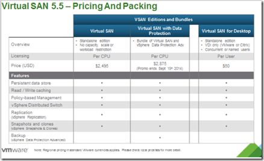
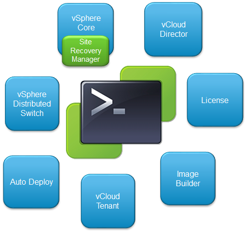

- VMware vSphere 5.5 Update 1. This update has support for Virtual SAN (VSAN) 5.5. VMware Virtual SAN is a software-defined storage technology that is available with vSphere 5.5 Update 1 (or later). A minimum of three nodes is needed. To check what hardware is supported, see the VSAN VMware Compatibility Guide for VSAN. [Link](http://www.VMware.com/resources/compatibility/search.php?deviceCategory=vsan). VSAN licensing is as follows:

 

vSphere 5.5 Update 1 supports vCenter on Windows Server 2012 R2. The release notes can be found here. [Link](https://www.VMware.com/support/vSphere5/doc/vSphere-vcenter-server-55u1-release-notes.html)

- VMware Horizon View Client for Windows 8,1 Store. The new version 2.3 has supports the PCoIP protocol. [Link](https://www.VMware.com/support/viewclients/doc/horizon-view-client-windows-store-release-notes.html)
- Horizon View 5.3.1 support for Virtual SAN (VSAN). There are no other new features in Horizon View 5.3.1 update besides VSAN.  VSAN Desktop is licensing is per user ($50 per user). More information:

1. Release Notes. [Link](https://www.VMware.com/support/view53/doc/horizon-view-531-release-notes.html) 
2. VDI Performance benchmarking on VMware VSAN 5.5. [Link](http://blogs.VMware.com/performance/2014/03/vdi-performance-benchmarking-VMware-virtual-san-5-5.html)
3. Horizon View 5.3.1 on VMware Virtual SAN - Quick Start Guide (2073795). [Link](http://kb.VMware.com/selfservice/microsites/search.do?language=en_US&cmd=displayKC&externalId=2073795)

- VMware vSphere PowerCLI 5.5 R2. This new release includes support for Site Recovery Manager (SRM) and expands current capabilities. More information [link](http://blogs.VMware.com/PowerCLI/2014/03/new-release-vSphere-powercli-5-5-r2.html).

