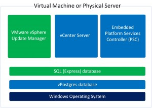

- When upgrading to vCenter Server 6.0, the Microsoft SQL Express database is migrated to a vPostgres database.
- Oracle, SQL Standard and Enterprise database editions will not be migrated to vPostgres.
- It is possible to upgrade without migrating the SQL database to vPostgres. Make sure you have a supported SQL database before upgrading. More information can be found here, [link](http://kb.VMware.com/selfservice/microsites/search.do?language=en_US&cmd=displayKC&externalId=2109321#sf37082730).
- When uninstalling vCenter Server 6 the  embedded VMware vPostgres database will be removed with all the data!  More information can be found here, [link](http://kb.VMware.com/selfservice/microsites/search.do?language=en_US&cmd=displayKC&externalId=2108547).
- How to backup and restore the vPostgres database there is a Python script available. This script can be found here, [link](http://kb.VMware.com/selfservice/microsites/search.do?language=en_US&cmd=displayKC&externalId=2091961).
- VMware vSphere Update Manager can't use the embedded vPostgres database! For VMware vSphere Update Manager you need a Microsoft SQL (Express) database.  When combining the vCenter Server, PSC and VUM on one server, two different databases engines are used. This looks like this:

