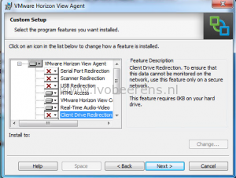
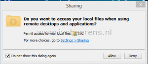
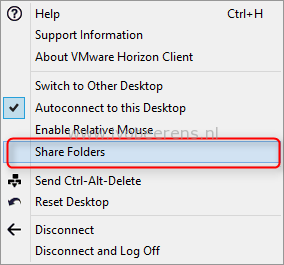
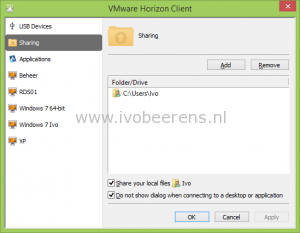
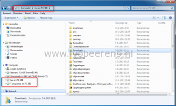

Here's a quick overview how-to enable Client Drive Redirection (CDR):

**Requirements**

- Horizon View 6.1.1 environment (Connection Server, composer etc.)
- View Agent 6.1.1 or later
- VMware Horizon Client 3.4.0 build-2769709

Install the Horizon View Agent. During the installation of the VMware Horizon Agent enable the Client Drive Redirection feature.

After installing the new Horizon View Agent is deployed on the Horizon View environment,  connect with  new 3.4.0 Horizon Client. When connecting for the first time to the there's  a pop-up asking to access your local files. Make sure to allow this and select "Do not show this dialog again".

In the Horizon View Client there is a option called "Share Folders". In the sharing box add local drives and folders to share in the VDI desktop session.

 

In the Windows Explorer the drives and folders that are mapped are visible.

 

**Note**: With Client Drive Redirection (CDR), the folders and files that are sent across the network are NOT encrypted!

