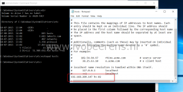
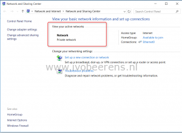
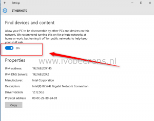
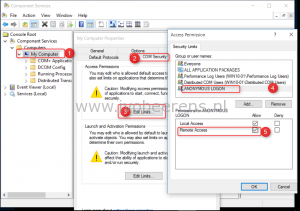
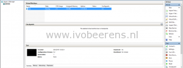
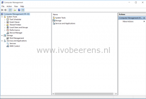

- Client with Hyper-V Manager (Windows 10). This client is called **win10-01**
- Server with Windows Server 2016 core version with the Hyper-V role enabled. The server is called **hv-02**
- Both systems are in the same workgroup called "workgroup"
- Both systems have the same username and password.

**Configuration on the Windows Server 2016  server**:

- Enable Remote Management

\[code language="PowerShell"\] Configure-SMRemoting.exe -Enable \[/code\]

- Open firewall for  Remote Computer Management

\[code language="PowerShell"\] Set-NetFirewallRule -DisplayGroup 'Windows Management Instrumentation (WMI)' -Enabled true -PassThru Set-NetFirewallRule -DisplayGroup 'Remote Event Log Management' -Enabled true -PassThru \[/code\]

- Open firewall for ping (ICMPv4)

\[code language="PowerShell"\] Set-NetFirewallRule -DisplayName “File and Printer Sharing (Echo Request – ICMPv4-In)” -Enabled True -PassThru \[/code\]

- Enable Remote Desktop and allow remote connections

\[code language="PowerShell"\] cscript.exe c:\\Windows\\System32\\SCregEdit.wsf /AR 0 \[/code\]

- Enable Remote disk management

\[code language="PowerShell"\] Set-NetFirewallRule -DisplayGroup 'Remote Volume Management' -Enabled true -PassThru \[/code\]

 

**Configuration on the Windows 10 client:**

- Create a host file with IP address and hostname of the server. Make sure you can ping the hostname

- Make sure that the network type is part of a private network before executing the WINRM command

 

- Enable Remote Management

\[code language="PowerShell"\] winrm quickconfig \[/code\]

- For Managing remote systems

\[code language="PowerShell"\] winrm set winrm/config/client @{TrustedHosts="Name of the Server"} \[/code\]

- Enable remote disk Management (add this command on both systems) firewall rule

\[code language="PowerShell"\] Set-NetFirewallRule -DisplayGroup 'Remote Volume Management' -Enabled true -PassThru \[/code\]

- Open c:\\windows\\system32\\dcomcnfg.exe and allow 'anonymous logon' for local and remote access.

After making this settings I was able to manage the Windows Server 2016 server with the following tools remotely:

- Hyper-V manager
- Computer Management
- Disk Management

 

 

