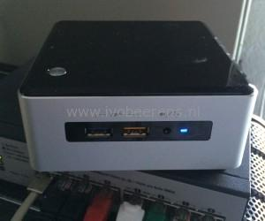
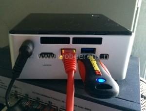
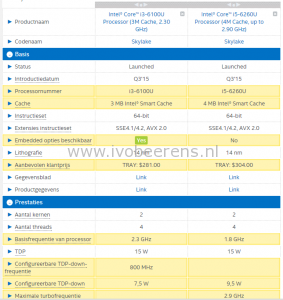
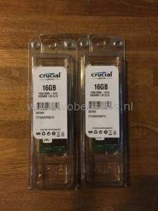
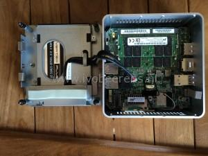
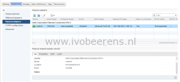
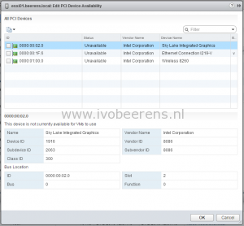
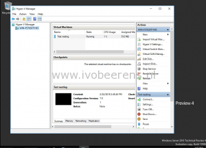

For my home lab I bought a 6th generation Intel NUC. The Intel NUC has following specifications:
- Intel NUC6i3SYH
- Intel i3-6100u (Skylake) 2.3 GHz Dual Core, 3 MB cache, 15W TDP
- 2 memory slots for DDR4-2133 SODIMM memory, maximum is 32 GB memory
- Intel HD Graphics 520 GPU
- Intel I219-V Gigabit network adapter and Intel Wireless-AC 8260 WIFI adapter
- Option to install a 2.5" HDD/SDD and a M.2 SSD card (2242 or 2280)
- 4 USB 3.0 ports (2 in the front and 2 on the rear)
- SD card reader (SDXC cards)
- Case and a 19V AC-DC adapter

 

The Intel NUC will be used as management server for my Software Defined DataCenter (SDDC) home lab environment. The Intel NUC will host VMs such as:

- Domain Controller + DNS
- vCenter Server Appliance
- Virtual SAN witness appliance
- Veeam backup
- Etc.

The VMs are stored on a Synology NAS. The Intel NUC will use a NFS connection to the Synology NAS.  The NUC will not have any disks. It will boot ESXi from the USB stick

**Processor**

The 6th generation Intel NUC leaves two choices for choosing a CPU:

- Intel I3 Skylake available on the NUC6i3SYH model
- Intel I5 Skylake available on the NUC6i5SYH model

Both CPUs have 2 cores and support hypertreading. The table below gives a quick comparison between both processors:

For this configuration the Intel NUC with the I3-6100u processor is sufficient and saves 100 euro. The I3 has 2 cores and hypertreading, so 4 logical processors are displayed in the hypervisor.

Other advanced technologies such as VT-x, VT-d, EPT are fully supported.

**Memory**

The Intel NUC has 2 memory slots and support up to 32 GB DDR4 2133 MHz SODIMM memory. I added  2 Crucial 16 GB DDR4-2133(CT16G4SFD8213) modules which makes a total of 32 GB memory.

 

I use the same memory as suggested by the blog "virten.net" [link](http://www.virten.net/2016/01/VMware-homeserver-esxi-on-6th-gen-intel-nuc/).

**Network card**

The Intel NUC has an Intel I219-V Gigabit network adapter and a wireless network card. Only the Intel I219-V can be used with VMware ESXi.

**Storage**

The NUC has a M.2 (PCIe Gen 3 x4) slot and a Intel AHCI SATA-600 controller. It is possible to install a 2.5" SDD or harddisk in the drive cage.

The VMs are on a Synology NAS. So the NUC will not have any disks other than a USB drive for booting VMware ESXi.

**VMware ESXi**

An USB 3 stick is used to boot VMware ESXi. On the USB stick is **VMware ESXi 6.0 U1b** (VMware-VMvisor-Installer-201601001 3380124.x86\_64) installed. For creating a USB stick with ESXi 6 you can use the blogpost [here](https://www.ivobeerens.nl/2011/09/17/create-a-bootable-VMware-esxi-5-usb-stick-in-windows-and-perform-a-scripted-installation/). Only step 1 till 3 are needed.

There is no need to add extra drivers to the ESXI image because the network and storage adapter are recognized by default.

 

Passthrough is supported by the CPU and motherboard.

Nesting such as VMware in VMware and Hyper-V in VMware is possible. Below is an screenshot of a Hyper-V Server with a VM hosted on ESXi.

**Power consumption**

The average power consumption of the NUC is between 20 and 30 watt with a couple of VMs active.

**Costs**

<table style="height: 149px;" width="419"><tbody><tr><td><strong>&nbsp;Component</strong></td><td><strong>Amount</strong></td><td><strong>Total</strong></td></tr><tr><td>Intel NUC NUC6i3SYH</td><td>1</td><td>€ 299,00</td></tr><tr><td>Crucial 16 GB DDR4-2133</td><td>2</td><td>€ 235,80</td></tr><tr><td>&nbsp;USB3 Stick 16 GB</td><td>1</td><td>&nbsp;€ 10,00</td></tr><tr><td><strong>Total</strong></td><td></td><td><strong>€&nbsp;544,80</strong></td></tr></tbody></table>

**Conclusion**

The 6th generation Intel NUC is an great and easy option for creating a small ESXi home lab. I use the Intel NUC as management server with a couple of VMs. Another use case is creating a 2/3- node hybrid Virtual SAN (VSAN) cluster. Put a Samsung 950 PRO in the M.2 slot for caching and a 2.5" HDD as capacity tier. Easy.

**Pros and cons**

Pros:

- All in-one-package including a motherboard, processor, enclosure and power adapter.
- Supports up to 32 GB of memory
- Easy to install
- Small Form Factor
- Low noise & power consumption

Cons:

- The hardware is not on the VMware HCL
- Need a converter to connect to a DVI or VGA monitor
- Only 2 cores available
- No expansion possibilities such as adding an extra netwerk card
- No remote management