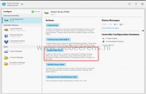
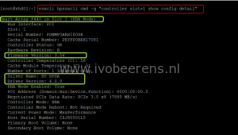

- HP Workload Accelerator as caching device
- HP Smart Array P440 controller with several 10k SAS disks as capacity tier

To enable VSAN the the first thing to do is to check the VSAN HCL([link](https://www.VMware.com/resources/compatibility/search.php?deviceCategory=vsan))

The VSAN HCL gives important information about:

- What hardware is supported?
- What configuration does the  HP Smart Array controller support?
- VSAN supported version(s)
- Device driver and firmware versions including the download location of the driver.

All the hardware is supported and the firmware levels are listed in the HCL. So the next step is to do is to configure the HP Smart Array P440 controller in Pass-Through mode. HP calls this "HBA mode". In HBA mode, all physical drives are presented directly to the operating system and the hardware RAID engine is disabled. This can be done in the Smart Storage Administrator.

After enabling the HBA mode the hosts needs a reboot.

The next step it to install the server with the HP Custom ESXi image . After the installation the ESXi, the HP Smart Array Controller is not recognized because the driver is not included. This same is for the HP Workload Accelerator that will serve for the caching tier. Download both drivers and add them to vSphere Update Manager. After both drivers are installed check the HP Smart Array Controller by using the following command (included in the HP Customed ESXi image):

\[code language="PowerShell"\] esxcli hpssacli cmd -q "controller "slot=1" show config detail" \[/code\]

_The "slot=" option depends on the slot number the HP Smart Array P440 controller is installed._

To list the drives attached to the controller with the following command:

\[code language="PowerShell"\] esxcli hpssacli cmd -q "controller slot=1 physicaldrive all show" \[/code\]

The Workload Acccelerator status can be displayed with the following command:

\[code language="PowerShell"\] fio-status \[/code\]

The last step is to  open the vSphere Web Client, start enabling VSAN and claiming the disks.

