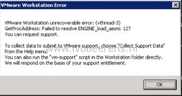

> VMware Workstation unrecoverable error: (vthread-3) GetProcAddress: Failed to resolve ENGINE\_load\_aesni: 127

This issue occurs when upgrading to VMware Update Manager to 5.5 Update 3e. I've seen this error when upgrading to 5.5U3e at different customer sites.

Here is a quick workaround:

- Uninstall VMware Update Manager and the VMware Update Manager plugins. The database is preserved, all the configuration data is stored in this database.
- Install VMware Update Manager and point to the existing VUM database
- Install the VUM plugin

Within a couple of minutes you're running VMware Update Manager 5.5 U3e.

There is also a VMTN forum post about this issue, [link](https://communities.VMware.com/thread/541951?start=0&tstart=0)

