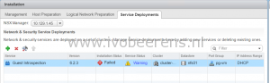

After performing the following steps, I was able to remove the Guest Introspection service :

- Put the ESXi host in maintenance mode
- Drag the ESXi host outside the cluster
- Drag the ESXi host back to the cluster
- Reboot the host
- Exit maintenance mode
- Click on resolve in the Service Deployments section

After performing these steps the Guest Introspection service is removed from the host.

