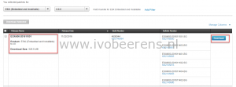
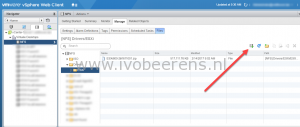
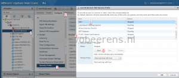
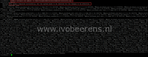

Here is a quick overview of how to patch an ESXi 6.x  or 7.x host to the latest patch or version (from ESXi 6 to 7 for example).

**Step 1**. Download the latest patch bundle from the VMware Web site, [link](https://www.VMware.com/patchmgr/findPatchByReleaseName.portal). VMware ESXi patches are cumulative!  Each patch bundle (.zip archive) includes all the updates from prior patches.

**Step 2**. Upload the patch bundle (zip) to a (central) datastore with the vSphere Client (prior vSphere 6.5), vSphere Web Client, ESXi host client.

**Step 3**. Enable SSH

In the vSphere Web client start the SSH service and make a SSH session to the ESXi host

**Step 4.** Put the host in maintenance mode

\[code language="PowerShell"\] vim-cmd hostsvc/maintenance\_mode\_enter \[/code\]

**Step 5**. Install the patch bundle

Using esxcli with the install method has the possibility of overwriting existing drivers. If you are using third-party ESXi images, VMware recommends using the **update** method to prevent an unbootable state. The following command will install the patch bunde:

\[code language="PowerShell"\] esxcli software vib update -d /vmfs/volumes/datastore/patchbundle.zip \[/code\]

For example install HPE ESXi 6 Update 3:

\[code language="PowerShell"\] esxcli software vib update -d /vmfs/volumes/VMFS01/VMware-ESXi-6.0.0-Update3-5050593-HPE-600.9.7.0.17-Feb2017-depot.zip \[/code\]

After the patch bundle is installed check the message. It must say "The update completed successfully, but the system needs to be rebooted for changes to be effective."

**Step 6**. Reboot the host  by entering the following command:

\[code language="PowerShell"\] reboot \[/code\]

**Step 7**. Make a SSH session to the ESXi host and exit maintenance mode

\[code language="PowerShell"\] vim-cmd hostsvc/maintenance\_mode\_exit \[/code\]

