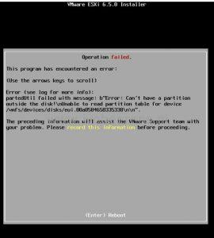
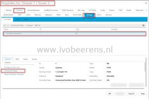

> Operation failed
> 
> This program has encountered an error:
> 
> partedUtil failed with message: "Error: Can’t have a a partition outside the disk! Unable to read partition table for device /vmfs/devices/disks...................

The solutions is simple, perform a format of the SD card in UCSM before installing VMware ESXi. The format option can be found under:

- Equipment -> Servers -> Select the server -> Inventory -> Storage - Controller -> Select the FlexFlash controller -> Format SD Cards

