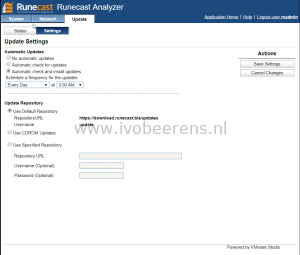
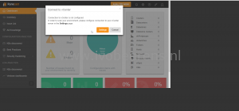
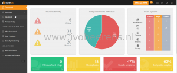
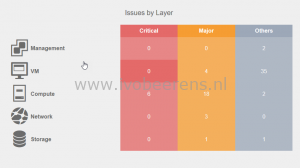
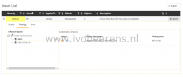
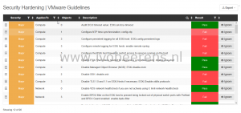
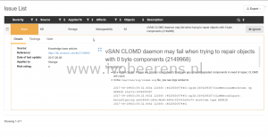

I’ve got the opportunity to test Runecast Analyzer. Runecast Analyzer **Proactively** use VMware KBs, best practices and security hardening guidelines to identify problems in your VMware environment. In this review you find my own experiences of testing Runecast Analyzer.

**Deployment**

The deployment of Runecast Analyzer is easy. It's an on-premises deployment on you're vSphere environment. Within a couple of minutes the Runecast is up and running. First download and deploy the virtual appliance OVA in an existing vSphere 5 or higher environment. During the deployment 3 appliance configuration sizes are available:

<table><tbody><tr><td><strong>Deployment</strong></td><td><strong>vCPU</strong></td><td><strong>Memory (GB)</strong></td><td><strong>Storage (GB)</strong></td><td><strong>Network</strong></td></tr><tr><td>Small</td><td>2</td><td>4</td><td>90</td><td>100Mbit=&gt;</td></tr><tr><td>Medium</td><td>4</td><td>8</td><td>90</td><td>100Mbit=&gt;</td></tr><tr><td>Large</td><td>8</td><td>32</td><td>90</td><td>100Mbit=&gt;</td></tr></tbody></table>

Choosing the appliance size, set the IP address and you're ready to access the appliance using a web browser After the appliance is deployed, the updating of the KB definitions, updates, application and OS updates can be configured in the VA admin interface of the appliance. When using the automatic updating feature you're always up-to-date. 

When the appliance has no internet connection, offline updates are available on the RuneCast website.

**Scan the vSphere environment**

Add one ore more vCenter Server(s) and you're ready to fire you're first scan of the VMware environment. The scan can be manually performed of scheduled.

After the scan of the environment the issues are displayed in a dashboard.  The issues are categorized in critical, major and medium.

Version 1.7 adds a new dashboard called "issues by layer". This dashboard categories the issues in 5 main layers: Management, VM, Compute, Network and Storage.

The detected issues are added in the five layers. This dashboard is interactive. By selecting the layer and issue you can drill-down and find the affected component and root cause.

It is possible to integrate RuneCast in the vSphere Web client. The plugin displays all issues detected by RuneCast Analyzer with the details and their root causes.

The vSphere Web Client HTML5 page looks awesome.

**Meltdown and Spectre**

Runecast is continuously monitoring the VMware KB articles and is able to detect Spectre and Meltdown issues. The great thing is that when VMware is updating or adding a Spectre or Meltdown KB issue, Runecast monitors that and alert you when the vSphere environment is affected. In the following example the Spectre/Meltdown issues are found.

You can drill down to see what hosts are effected.

**Log Analytics**

Runecast Analyzer includes log analytics. Runecast collects the syslogs from the ESXi hosts and do a smart analytics to discover possible problems found in KBs.

**Hardening**

Runecast Analyzer uses VMware Security checks (https://www.VMware.com/security/hardening-guides.html) and DISA STIG 6 to check the compliance of the vSphere environment. The results are reports in a dashboard.

**vSAN support**

Version 1.7 adds support for VMware vSAN environments. It scans vSAN clusters and test their configurations against VMware KB articles and best practices. When issues are found guides are added how to fix them. For example in a customer vSAN environment Runcast Analyzer found the following vSAN problem:

When drilling down the guide tells me that this issue is fixed in ESXi 6.5 Update 1 (vSAN 6.6.1). After patching, the issue was solved without occurring in the vSAN environment. This is what I called "proactive management".

**Conclusion**

With Runecast Analyzer every VMware vSphere admin can proactively identify possible (security) problems in there vSphere environment. The installation is easy and fast. Within a couple of minutes the appliance ready for the first scan. As VMware consultant I use Runecast on frequently basis which gives me a great overview of the state of the vSphere environment i'm working with.

Every new release adds great new features such as vSAN and vSphere Web Client (HTML5) support. The next release will contain NSX-V support.

In my opinion Runecast Analyzer is a must have tool for every VMware vSphere admin to proactively monitor there environment.

**Wanna try?**

There is a 14-day free trial available from this [link](https://runecast.biz/).