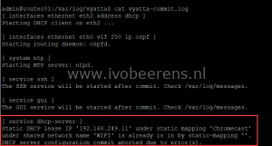

In the EdgeRouter GUI I didn't find any clue why the WIFI devices didn't get an IP address anymore, so I opened a SSH session to the EdgeRouter and start troubleshooting. First I tried to start the DHCP service by using this command.

\[code language="text"\] sudo service dhcpd start \[/code\]

The following error is displayed:

> \[....\] Cannot start the DHCP server because configuration file /opt/vyatta/etc/d \[FAILconf is absent. ... failed!

The DHCP service cannot be started, that's the problem why the WIFI devices didn't get an IP address anymore. Then i looked in the following log files:

- _cat /var/log/messages_
- _cat /var/log/vyatta/vyatta-commit.log_

In the _vyatta-commit.log_ the following error is displayed under the \[service dhcp-server\] section:

> \[ service dhcp-server \] Static DHCP lease IP '192.168.249.11' under static mapping 'Chromecast' under shared network name 'WIFI' is already is in by static-mapping ''. DHCP server configuration commit aborted due to error(s).

In the DHCP scope for the WIFI VLAN there was a static IP mapping called "Chromecast". I removing the "Chromecast" static IP mapping in the GUI of the EdgeRouter. In the SSH session tried to start the DHCP service by using the following command.

\[code language="text"\] sudo service dhcpd start \[/code\]

> Starting DHCP server daemon...

The DHCP service is started.  In the _vyatta-commit.log_ no new errors are displayed and the WIFI devices were able to get an IP address.  Removing the "Chromecast" static mapping cleared the duplicate static IP error.

