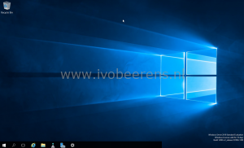
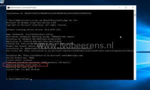

In this example below, the Windows Server 2016 evaluation has only 10 days remaining . 

 

To extend the evaluation period the following steps can  be used:

- - Open an elevated command prompt (cmd)
    - Enter the following command:

\[code language="text"\]cscript.exe %windir%\\system32\\slmgr.vbs /dlv\[/code\]

- - - There are 6 remaining rearms available. This means the Windows Server evaluation version can be used for 3 years. To rearm use the following command:

\[code language="text"\]cscript.exe %windir%\\system32\\slmgr.vbs /rearm\[/code\]

- - Restart the system 
    - After the restart the evaluation period is extended for another 180 days

