I had the following requirements for the new home lab host:

- Ability to run the latest VMware ESXi 6.7 U1 version
- Support for 64 GB memory
- Fast storage support (M.2 NVMe SSD)
- Room for PCI-Express add-on cards
- Run nested environments
- Low power consumption
- Limited budget (around 1300 euro).

I did some research for a new home lab host and investigated hosts such as the Intel NUC, Apple Mac Mini 2018, Supermicro and Shuttle. In my searching journey I'll ended having the following Bill Of Materials (BOM) shopping list:

<table><tbody><tr><td><strong>Parts</strong></td><td><strong>~Price (€)</strong></td><td><strong>Link&nbsp;</strong></td></tr><tr><td><strong>Barebone System</strong>: Shuttle XPC cube barebone&nbsp;SH370R6 Plus (500 Watt (80 PLUS Silver) PSU.</td><td>&nbsp;291,00

&nbsp;</td><td><a href="https://tweakers.net/pricewatch/1250583/shuttle-xpc-cube-sh370r6-plus.html" target="_blank" rel="noopener noreferrer">Link</a></td></tr><tr><td><strong>CPU</strong>: Intel Core i7 8700 with 6 cores and 12 threads 65W</td><td>&nbsp;333,45

&nbsp;</td><td><a href="https://tweakers.net/pricewatch/1051083/intel-core-i7-8700-tray.html" target="_blank" rel="noopener noreferrer">Link</a></td></tr><tr><td><strong>Memory</strong>: 4 x 16 GB, Kingston ValueRAM KVR26N19D8/16</td><td>&nbsp;488,00</td><td><a href="https://tweakers.net/pricewatch/839937/kingston-valueram-kvr26n19d8-16.html#filter:q1YqSKzMTc0r8UxRsjI0qAUA" target="_blank" rel="noopener noreferrer">Link</a></td></tr><tr><td><strong>Disk</strong>: Samsung 970 EVO 1 TB M.2</td><td>&nbsp;217,99</td><td><a href="https://tweakers.net/pricewatch/1169447/samsung-970-evo-1tb.html" target="_blank" rel="noopener noreferrer">Link</a></td></tr><tr><td><strong>USB stick</strong>: Kingston Datatraveler 100 G3 32 GB</td><td>&nbsp; &nbsp;7,30</td><td><a href="https://tweakers.net/pricewatch/340574/kingston-datatraveler-100-g3-32gb-zwart.html" target="_blank" rel="noopener noreferrer">Link</a></td></tr><tr><td><strong>Total</strong></td><td><strong>1337,74</strong></td><td></td></tr></tbody></table>

_**Update May 13, 2019**: _ A new Shuttle **SH370R8** is released. The Shuttle SH370R8 has the following new enhancements:

- 9th generation Intel Core i9 processor support (The latest BIOS of the SH370R6 Shuttle also supports the 9th generation of Intel Core CPUs).
- Dual Intel Gigabit Ethernet onboard NICs
- Support for four 3.5" hard drives

A review can be found here, [link](https://www.ivobeerens.nl/2019/06/04/using-the-shuttle-sh370r8-as-home-lab-server-with-VMware-esxi/).

**Barebone System**

A barebone is pre-installed system with a mainboard, GPU, Power Supply Unit (PSU), CPU cooler and cables in a small form factor. You'll need to pick certain parts such as CPU, memory and disk(s) to match you're needs. The Shuttle XPC cube barebone SH370R6 Plus has the following specifications:

- **Chassis**: black aluminium (33.2 x 21.5 x 19 cm)
- **Bays**: 1 x 5.25 and 2 x 3.5"
- **CPU**: Socket LGA 1151 v2. Supports 8th and 9th generation Intel Core "Coffee Lake" processors such as Core i9 / i7 / i5 / i3, Pentium or Celeron  Shuttle has a I.C.E. heatpipe cooling system. A CPU with a maximum of 95 Watt Thermal Design Power (TDP) is supported.
- **Integrated Graphics**: Intel UHD graphics 610/630 (in the processor). Supports three digital UHD displays at once
- **Chipset**: Intel H370 PCH
- **Memory**: up to 4 x 16 GB DDR-2400/2666 DIMM modules. Max 64 GB
- **Slots**: 1 x PCIe X16 (v3.0) supports dual-slot graphics cards up to 273 mm length, 1 x PCIe X4 (v3.0), 1 x M.2-2280 (SATA / PCIe X4) supports M.2 SSDs, 1 x M.2-2230 supports WLAN cards
- **SATA**: 4 x SATA 3.0 (6 Gb/s) supports RAID and RST
- **Video**: HDMI 2.0a and 2 x DisplayPort 1.2
- **Connections**: 4 x USB 3.1 Gen 2, 4 x USB 3.1 Gen 1, 4 x USB 2.0,
- **Audio**: 5 x Audio (2 x front, 3 x rear)
- **Network**: Intel Gigabit I211 adapter
- **PSU**: Integrated 300  Watt (80 PLUS Bronze) in the SH370R6 or 500 Watt (80 PLUS Silver) in the SH370R6 plus version.

 [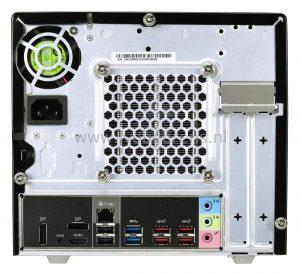](https://www.ivobeerens.nl/wp-content/uploads/2019/01/SH370R6-hi-backview.jpg)

 

 

 

 

 

 

The Shuttle  SH370R6 plus has a 500 W Power supply so a GPU can be added  if needed. For now I will use the onboard GPU. There is one Intel Gigabit I211 NIC onboard.

**Slots**

The Shuttle has two slots available for add-on cards:

- 1 x PCIe X16 (v3.0) supports dual-slot graphics cards up to 273 mm length,
- 1 x PCIe X4 (v3.0)

I will use both slots with spare sparts, one slot for a Intel Gigabit  NIC and the other slot for an extra M.2 slot. In the future I can change the 1 Gigabit NIC for a 10 Gigabit NIC for example.

**CPU**

As CPU i decided to use an Intel Core i7 8700 8th generation Intel Core "Coffee Lake" processor with 6 cores and 12 threads.  It has a Thermal Design Power (TDP) of 65 W. The decision was based on pricing, horse power and  power consumption.

**Memory**

The maximum memory the Shuttle can handle is 64 GB. This is very unique for a barebone system on the moment. There a 4 DIMM slots for 4 x 16 GB. I used Kingston ValueRAM KVR26N19D8/16 that is not on the Shuttle hardware compatibility list (**\*1**) but can be found in the Kingston compatibility list.

**Storage**

The Shuttle has one M.2 2280 slot. The Samsung EVO 970 1 TB NVMe SSD will be used as local datastore for storing VMs. Besides the SSD I use an existing QNAP NAS with a NFS connection to this host. ESXi will be installed in the USB stick.

(**\*1**) Shuttle has a hardware compatibility list available ([link](http://global.shuttle.com/products/productsSupportList?productId=2365)).

## Hardware installation

Once all the hardware parts were delivered it was time to build the Shuttle XPC SH370R6 Plus. Shuttle provides step by step documentation that describes every step.

[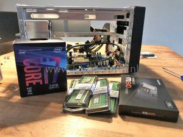](images/20190112_111241348_iOS.jpg)

- Open the barebone Shuttle by removing 3 screws on the back and the move the aluminium case away.
- Install the Intel CPU and add some thermal paste.

[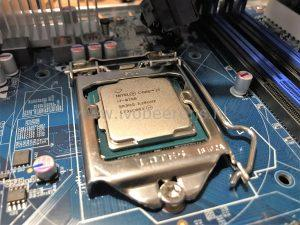](images/20190112_113219379_iOS.jpg) [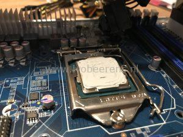](https://www.ivobeerens.nl/wp-content/uploads/2019/01/20190112_113705505_iOS.jpg) 

- Shuttle has a own Integrated Cooling Engine (I.C.E.) heatpipe technology that delivers cooling for the CPU with a 92 mm fan.

[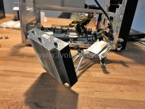](images/20190112_113820754_iOS.jpg)[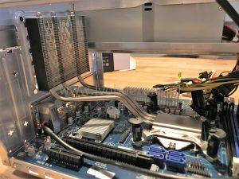](https://www.ivobeerens.nl/wp-content/uploads/2019/01/20190112_114252818_iOS.jpg)

- Mount the I.C.E. heatpipe cooler on the CPU and attach the fan.

[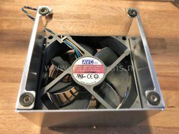](images/20190112_114340469_iOS.jpg) [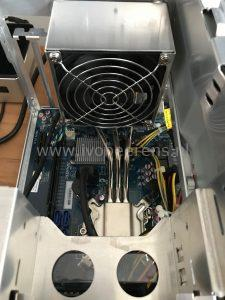](https://www.ivobeerens.nl/wp-content/uploads/2019/01/IMG-0694.jpg)

- The Shuttle supports up to 64 GB DDR4 memory. Insert the 4 memory modules in the DIMM slots.

[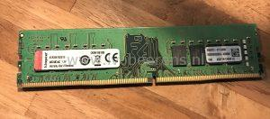](images/20190112_114616888_iOS.jpg)

- Attach the Samsung EVO 970 1 TB NVMe SSD in the M.2 2280 slot.

[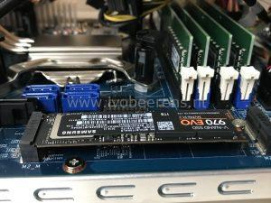](images/20190113_122700343_iOS.jpg)

- The mainboard has two slots for PCI-e cards, 1 x PCIe X16 (v3.0) supports dual-slot graphics cards up to 273 mm length for example and 1 x PCIe X4 (v3.0). I added the following spare parts that are lying around:
    - Intel Gigabit NIC (dedicated for my storage connection to my QNAP NAS).
    - PCIe to M.2 adapter (Lycom DT-120 M.2 PCIe to PCIe 3.0 x4 Adapter) and  installed a Samsung 950 Pro 512 GB M.2 SSD.

[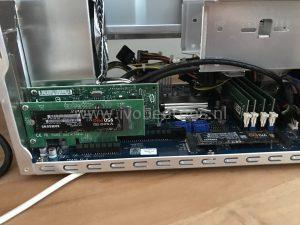](images/20190122_145557198_iOS.jpg)

The documentation that Shuttle provides is very clear so the hardware installation went without any problems. Once the hardware parts are installed it was time for the first power-on. After the power-on I entered the BIOS and modified some settings such as:

- Boot order
- Disabled some hardware devices you don't use such as audio
- Use Smart FAN mode for controlling the FAN speed
- Modify the power management by enabling "Power-On after Power-Fail"

## Operating Systems

The Shuttle has no remote management functionality so you'll need a physical monitor, mouse and keyboard  physically connected for the software installation. Once the installation is done, remote management in the software can be enabled.  Windows Server 2019 with the Hyper-V role and VMware ESXi 6.7 U1 is installed on the Shuttle SH370R6 plus. Both OSes are not officially supported. Here are my installation experiences:

### Windows Server 2019

As test I installed Windows Server 2019 on the Samsung EVO 970 1 TB. The installation of Windows Server 2019 is finished within a couple of minutes. The onboard Intel Gigabit I211 NIC is not recognized by the Windows. The Intel driver is only for Windows 10 and won’t install on a server OSes by default. This issue is there for a long time (see [link](https://www.ivobeerens.nl/2013/06/24/enable-the-intel-i217-v-nic-in-windows-server-2012/)). Intel does not want that desktop NICs are being used on Windows Server OSes. With some hacking ([link](https://blog.workinghardinit.work/2017/06/19/installing-intel-i211-i217v-i218v-i219v-drivers-windows-server-2016-eufi-boot/)) it is possible to enable the NIC. The add-on Intel Gigabit NIC is recognized by default in Windows Server 2019. Enabled the Hyper-V role and installed some VMs without problems. The user experience is fast, very fast!

[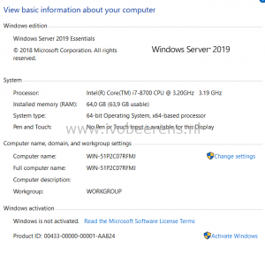](images/system-1.png) [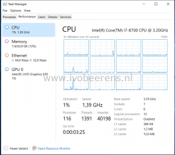](https://www.ivobeerens.nl/wp-content/uploads/2019/01/task-manager.png)

 

### VMware ESXi

After the Windows Server 2019 test, it was time to create an USB stick ([link](https://www.ivobeerens.nl/2018/09/16/quick-tip-create-a-bootable-VMware-esxi-key/)) and install VMware ESXi  6.7 U1. The installation is a piece of cake. The onboard Intel Gigabit I211 NIC is recognized by ESXi and will be used for management and VM traffic in my config. The add-on Intel 1 GbE NIC is configured as NFS connection to my existing QNAP NAS. After some initial configuration (network and storage connection, NTP, and licensing) I migrated all the VMs from my old NUC to the new Shuttle. Most VMs are placed on the NVMe SSDs. I really like to performance boost of the VMs when they are running on the new hardware. When the load increases on the Shuttle the fan will make more noise (Smart FAN mode ). This can be annoying when you're in the same room. In the BIOS you can tweak the FAN speed. For me this is not a problem because i'll have a separate room were my home lab servers resides.

[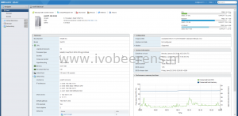](images/esxi01.png)  

The onboard SATA controller is recognized by ESXi. I attached two single SSDs to the controller and created a VMFS-6 partition.

 

**vSAN**

By adding a PCIe  to M.2 adapter and a 10 Gigabit NIC it's possible (not tested yet) to create a All Flash NVMe vSAN node. I added a PCIe to M.2 adapter and added a NVMe SSD and having two NVMe SSDs that are recognized by ESXi (see storage screenshot above).

**Power Consumption**

When the Shuttle is booted with ESXi and the two add-on cards are added without any VMs powered-on, the power consumption is around 20-24 W. The power consumption is depending on the amount resources that are being used. In my configuration, running 10 VMs that are using between 35 and 70 W.

[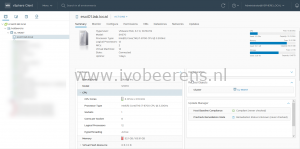](images/esxi05.png)

# Conclusion

The Shuttle SH370R6 Plus home lab host is now running for a couple of weeks. Here are my findings:

- Depending on your requirements (such as budget) you can customize the SH370R6 Plus for you're needs.
- The hardware installation was easy and without problems. The documentation that Shuttle provides is very clear.
- There two version of the  Shuttle: the SH370R6 and the SH370R6 Plus. The PSU is the difference, the plus version has a 500 W PSU (for adding a GPU).
- The Shuttle barebone has a lightweight aluminium case (33.2 x 21.5 x 19 cm). This is a lot bigger than a Intel NUC but gives more extensible by adding hardware.
- Using a 8th generation Intel I7 8700 with 6 cores and 12 threads with a TDP of 65 W is cost efficient and consumes less power but still having a powerful CPU (VMs with 12 vCPU are possible to create).
- The Shuttle Barebone System supports up to 64 GB memory. For a barebone is every unique on the moment. Most barebone systems supports a maximum of 32 GB on the moment!
- There is one M.2-2280M SSD slot for a NVMe SSD on the mainboard. By adding a PCIe to M.2 adapter you can add an extra NVMe SSD. Great for a vSAN All Flash (AF) use cases.
- There is room for two 3.5" HDDs. I didn't test if the SATA controller are recognized by ESXi because I use M.2 SSDs and NFS storage.
- Two PCI-Express slots are available: 1 x PCIe X16 (v3.0) and 1 x PCIe X4 (v3.0).  This makes it possible to add a GPU and 10 Gigabit adapter for example.
- When the load increases on the Shuttle the fan will make more noise (Smart fan mode ). This can be annoying when you're in the same room. In the BIOS you can tweak the fan speed. For me this is not a problem because i'll have a separate room the the home lab servers.
- The Shuttle is not officially certified and supported by VMware and Microsoft
- The performance and user experience are fast, very fast!
- More information about the Shuttle SH370R6 Plus can be found here, [link](http://www.shuttle.eu/products/mini-pc/sh370r6-plus/).

I'm happy with my new home lab member, the Shuttle SH370R6 Plus because all my requirements are met and I really like to performance boost of the VMs.

