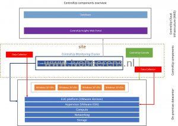
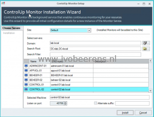
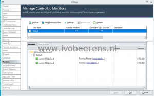
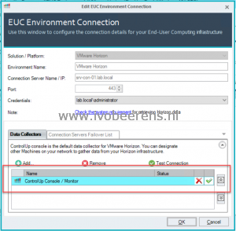
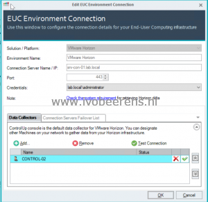

- **Monitor Cluster**. This new cluster model adds support for monitoring more VDI endpoints per site.
- **VMware Horizon integration**.  ControlUp has now native integration with VMware Horizon environments.

In this part of the blog post, I explain the basics of the new Monitor Cluster.

## Monitor Cluster

The new cluster monitor model enables adding more active monitor nodes to the monitor cluster to increase VDI scalability. Each node can support up to 5000 VDI endpoints. The amount of supported VDI endpoint depends on the processes that are active in the VDI. Below is a simple overview of the new cluster monitor model.

Monitors that belong to the same site automatically balance monitoring loads. With this new model, more VDI endpoints per site can be monitored than previous versions.

Adding extra sites allows monitors to monitor resources on an isolated network or on remote networks with low bandwidth links.  All monitors deployed to these sites must be able to route back to the initial site to receive instructions.

For a monitor node with support up to 5000 VDI endpoints ControlUp recommends  the following sizing:

- Windows Server OS with
- 8 vCPUs
- 32 GB memory for up to  5000 VDI endpoints. When designing for High Availability, use the N+1 rule. For example, a customer with 8000 VMs needs three monitor nodes.

The amount of VDI endpoints a monitor node supports depends on the processes that are active in the VDI endpoint. For example, a Windows 7 VDI has an average of 120 processes. For Windows 10 an average is 200 processes.

More information on sizing ControlUp can be found here, [link.](https://support.controlup.com/hc/en-us/articles/360003418597-Sizing-Guidelines-for-ControlUp-v8-x)

In the screenshots below an extra monitor node is added to the monitor cluster. After adding it you see two dedicated monitor nodes in the same site. The loads is automatically balanced between the nodes.

 

In the Manage ControlUp monitors (see right screenshot above) you have now the ability to manage monitors and sites.

### Data Collector

A Data Collector is responsible for collecting metrics from VMware vCenter, VMware Horizon, Citrix Delivery Controllers, XenServer Poolmasters, AHV Clusters, and NetScaler appliances. By default, the ControlUp Monitor/Console will be the Data Collector. In the screenshot below we see that the Data Collector for the VMware Horizon environment is the ControlUp Console / Monitor.

This means when having more Data Collectors for example to the VMware Hypervisor the console initiates several API requests each interval. In larger environment the traffic can be substantial. When managing over 500 VDI endpoints it's recommended to use dedicated Data Collector(s). Per data collector, you can designate another machine on your network to gather data from the VMware Horizon environment for example. More on sizing Data Collectors can be found here, [link](https://support.controlup.com/hc/en-us/articles/360002162597).

For a Data Collector make sure the ControlUp agent (including the .NET framework) is installed on the machine(s).

After adding the new Data Collector remove the ControlUp Console/Monitor.

More information on the data collector can be found here, [link](https://support.controlup.com/hc/en-us/articles/360002162597).

## Conclusion

With ControlUp 8.1 it is now possible to add more VDI endpoints with the new Monitor Cluster model. Because of this, it's now possible to monitor large VMware Horizon environments with ControlUp. In part 2 of this blog post, I will highlight the new VMware Horizon integration.

