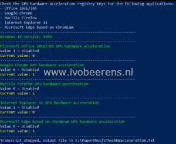

When no GPU is installed: disable hardware acceleration and when a GPU is installed: enable the hardware acceleration in the application.

I created a script to check the GPU hardware acceleration registry keys for the following applications: - Office 2016/365 (For Office 2013 and 2019 you need to change the script) - Google Chrome - Mozilla Firefox - Internet Explorer 11 - Microsoft Edge based on Chromium

If you have other applications to check let me know. The script can be found on my GitHub page found [here](https://github.com/ibeerens/PowerShell/blob/master/CheckHWacceleration.ps1).

