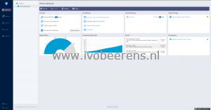

In version 10 of Nakivo Backup and Replication the following new improvements are added:

- **VMware vSphere 7 support**. vSphere 7 support for Nakivo Backup & Replication. This is the latest version of VMware vSphere when writing this blog post.
- **User Interface Enhancements**. The user interface has a new facelift to improve the experience with the product.

- **Physical Machine Recovery to VMware (P2V)**. To protect mixed physical and virtual IT environments, Nakivo Backup & Replication offers the Physical to Virtual Machine Recovery feature.
- **Backup to Wasabi Hot Cloud Storage**. You can create backup repositories in Wasabi buckets for backing up and storing virtual and physical machines.

- **Linux Workstation Backup**. Perform app-aware, incremental backups of Linux workstations running Ubuntu 18.04 Desktop and 20.04 Desktop. Quickly recover entire workstations or restore individual files and objects directly from backups.

**Other improvements are**:

- Application permissions for Microsoft 365 accounts have been updated. Make sure you make the necessary changes to prevent backup and recovery jobs from failure. Refer to Obtaining Microsoft 365 credentials (item 10) for details.
- CentOS v7.0-7.6 support
- Improvements for Backup to Amazon S3

The release notes can be found here: [link](https://helpcenter.nakivo.com/display/RN/v10.0+Release+Notes) and a free trial can be found here: [link](https://www.nakivo.com/resources/download/trial-download/?utm_source=ivobeerens.nl&utm_medium=article&utm_campaign=backup).

