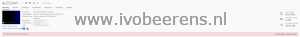
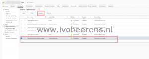

I see this behavior in a lot of  VDI environments with PCI passthrough GPU cards. Customers I work for ask me to disable this annoying alarm. This can be easily done in the vSphere Client by disabling the "Virtual machine memory usage" alarm:

 

When using PowerCLI this can be done with the following command:

\[code language="PowerShell"\] Get-AlarmDefinition -Name 'Virtual machine memory usage' | Set-AlarmDefinition -Enabled:$false \[/code\]

