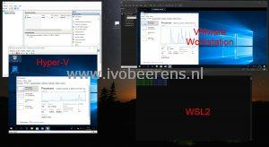

Requirements:

- Windows 10 2004 or newer
- VMware Workstation 15.5.5 or newer
- Supported CPU: Intel Sandy Bridge or an AMD Bulldozer or newer

I tested this with my Windows 10 laptop with the Hyper-V role enabled, the Windows Subsystem for Linux running, and VMware Workstation 16 Pro. In Hyper-V and VMware Workstation a Windows 10 VM is running. In the screenshot below you see all the components started:

This is very cool, now you can run VMware Workstation and Hyper-V role at the same time even with the WSL active.

