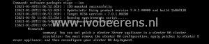
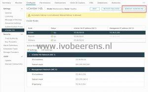

When I tried to stage the ISO on the witness node the following error occurred:

> You can not patch a vCenter Server appliance in a vCenter HA cluster. **resolution**: You must remove the vCenter HA configuration, apply patches to vCenter Server appliance, and then reconfigure your vCenter HA deployment.
> 
> 

So I removed the vCenter Server HA cluster configuration and patched the single vCenter Server Appliance.

After the patching of the single VCSA, I redeployed the VCHA cluster again.

**Conclusion**: The vCenter Server HA cluster documentation still has the VCHA 6 update procedure documented that does not work anymore. I will update this blog article if there is more information available.

