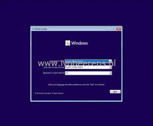
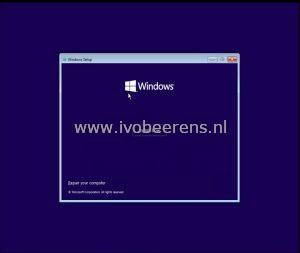
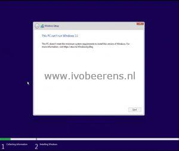
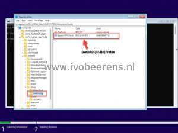
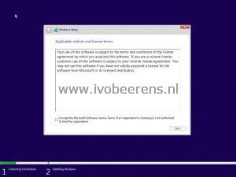
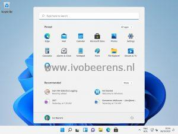

The first step is to download Windows 11. This can be done by visiting the Windows 11 download page ([link](https://www.microsoft.com/en-us/software-download/windows11)) and download the ISO image or create an ISO image with the MediaCreationTool ([Quick Tip: Download the latest Windows 10 ISO file](https://www.ivobeerens.nl/2021/05/19/quick-tip-download-the-latest-windows-10-iso-file/)). After the download put the ISO on a datastore and create a VM with the following specifications:

- Hardware Specifications:
    - Compatibility: ESXi 7.0 U2 and later (I'm using ESXi 7)
    - Guest OS: Windows 10 (64-bit)
        - Enable Windows Virtualization Based Security: Check
    - CPU: 2
    - Memory: 4 GB
    - Hard Disk: 64 GB
    - CD/DVD: Datastore on ISO
        - Connect: Check
- Boot the VM with the ISO connected and the installation of Windows 11 will begin.
- Select the correct Language, Time and currency format, and keyboard layout

- Select "Install Now"

- A Message appears that this PC can't run Windows 11

- Press **Shift** + **F10**
- A DOS box appears. Typ **regedit** and hit **enter**

- Navigate to **HKEY\_LOCAL\_MACHINE\\SYSTEM\\Setup** and create a new Key named **LabConfig**
- Create in the LabConfig Key a **ByPassTPMCheck** DWORD (32-bit) with the value of **1**
- Close the Regedit window (click on the Red X in the right corner)
- Typ **exit** to leave the command prompt
- Click on the Red X in the right corner and the setup will start again

- The setup is now able to install Windows 11 as VM in VMware ESXi or VMware Workstation.
- When the setup is finished you have a Windows 11 VM running.

With this procedure, you can run Windows 11 on hardware that doesn't have a TPM 2.0 chip.  This procedure is not officially supported of course! For example, you may not receive security updates in the future if you bypass the hardware requirements such as TPM.

VMware vSphere supports a Virtual Trusted Platform Module (vTPM) that emulates a physical TPM 2.0 without having one. Want to know more? Read my other blog post called "[Install Windows 11 on VMware vSphere with a virtual TPM](https://www.ivobeerens.nl/2021/10/07/install-windows-11-on-VMware-vSphere-with-a-virtual-tpm/)".

