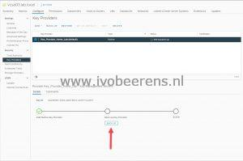
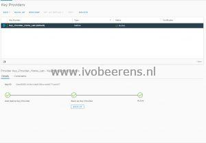
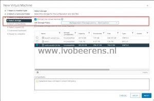
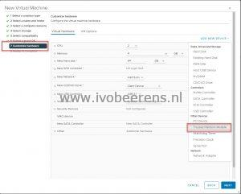
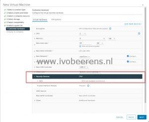
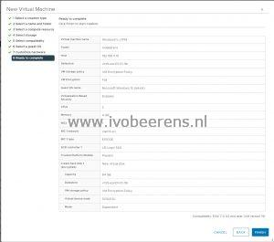
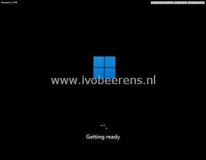

Yesterday I wrote a blog called “Install Windows 11 as VM on VMware vSphere / Workstation without TPM 2.0 chipset“. In this blog article, I explained how to install Windows 11 without having a TPM 2.0 chipset by using a registry hack. Paul Braren from tinkertry.com created a cool video (link) about installing Windows 11 on VMware vSphere using my blog article. Bob Plankers (@plankers) replied on Twitter that virtual TPM can be used too.

> You can just add a virtual TPM in Workstation or vSphere, too. — (@plankers) October 6, 2021

So I did some research in my home lab. With VMware vSphere and VMware Workstation, it is possible to install Windows 11 by using a vTPM device that emulates a physical TPM 2.0 chipset without having one. This is called Virtual Trusted Platform Module (vTPM). A vTPM performs the same functions as a hardware TPM, it performs cryptographic coprocessor capabilities in software So without having a physical TPM 2.0 you can run Windows 11 without performing any hacks to the Windows 11 Operating System.

In this blog post, I explain how to configure vTPM for VMware vSphere and install Windows 11. Here are the steps:

### **Requirements for vTPM**

- EFI firmware
- Hardware Version 14 or later
- vSphere 6.7 or later
- Virtual Machine encryption
- Key Provider. The Key Provider is used to enable encrypted technologies such as TPM

### To enable vTPM you must first add a Key Provider

- Open the vSphere Client URL (**https://vcentername/ui**)
- Log-in
- Click on the vCenter name - **Configure** and select **Key Providers**
- Click on **ADD**
- Select **Add Native Key Provider.** When using the Native Key provider you don't need an external key server**.**
- Enter a name for the Key Provider and **uncheck** "Use key provider only with TPM protected ESXi hosts (Recommended).

- Select **Backup** and uncheck "**Protect Native Key Provider data with password (Recommended)**" and click on **BACK UP KEY PROVIDER**

- The Key Provider is configured and active now

### **Windows 11 VM Configuration**

For the Windows 11 VM configuration, I configured the following:

- Create or download a Windows 11 ISO (for more information see the blog post mentioned at the beginning).
- Copy the ISO to a datastore that can be accessed  when used to install Windows 11

In the vCenter client create a new VM with the following specification:

- **Configuration step 1:** Create a new Virtual Machine
- **Configuration step 2:** Enter the Virtual Machine name
- **Configuration step 3:** Select the ESXi host or cluster for the VM
- **Configuration step 4:** Select the datastore and select **Encrypt this virtual machine**

- **Configuration step 5: Compatibility**: ESXi 7.0 U2 and later (I’m using ESXi 7)

- **Configuration step 6: Guest OS**: Guest OS Family: Windows
  - Guest OS Version: Windows 10 (64-bit)
  - Enable Windows Virtualization Based Security: Check

- **Configuration step 7: CPU:** 
  - 2 or more
  - Memory: 4 GB or more
  - Hard disk: 64 GB or more
  - CD/DVD: Mount the ISO on the datastore
  - Custom Hardware Select **Add New Device** and choose for **Trusted Platform Module**

  **Configuration step 8:** VM configuration overview
    - Click on Finish

- Start the VM and the installation begins without complaining that this PC can’t run Windows 11

Windows 11 can be installed without having a physical TPM 2.0 chipset or using the registry hack mentioned at the beginning of the blog post. How cool is that!