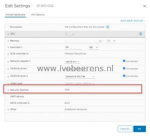

The latest Packer Plugin for VMware vSphere (V1.0.3) has now support for adding a vTPM device. Default a vTPM device is not added to the VM deployed with Packer. So if you want to create a Windows 11 Golden Image for example you can use Packer with the VMware vSphere plugin with a vTPM device.

Here are the high over steps outlined to add a vTPM device when provisioning a new VM with Packer.

- - Download Packer 1.7.9  or later (https://www.packer.io/downloads).
    - Add the VMware vSphere plugin to the HCL configuration file (https://github.com/hashicorp/packer-plugin-vSphere)

packer {
  required\_version \= "\>= 0.0.1"
  required\_plugins {
    vSphere \= {
      version \= "\>= 0.0.1"
      source  \= "github.com/hashicorp/vSphere"
    }
  }
}

- Add a variable to enable vTPM

variable "vm\_tpm" {
  type = string
  default = "true"
}

- In the vSphere-iso section, add the vTPM configuration parameter that uses the vm\_tpm variable to enable the vTPM device (more options can be found here, [link](https://www.packer.io/plugins/builders/vSphere/vSphere-iso))

source "vSphere-iso" "win11basic" {
  vTPM = "${var.vm\_tpm}"
}

- Perform a packer init command to download the Packer plugin binaries define in the config file
    - packer init config.pkr.hcl
- Run the packer build command to create the VM
    - packer build config.pkr.hcl

The VM will be created with a vTPM device.

With Packer and the VMware vSphere plugin, it is now possible to create a VM with a vTPM device which is needed for deploying Windows 11 VMs. This is a great improvement!

