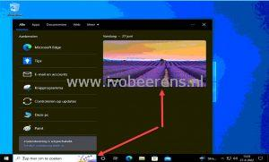
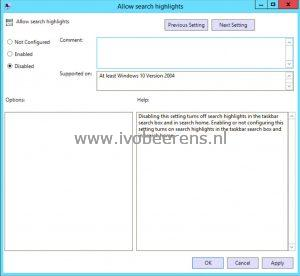

**So what are search highlights?**

> Designed to help Windows users discover more information and related content, search highlights present noteworthy, informative, and interesting information of what's special about each day—like holidays, anniversaries, and other moments in time both globally and in your region

This new feature can be nice for home users but not for most enterprise environments. So I disable this feature for all the Windows 10/11 deployments.

**Disable search highlights by using a Group Policy Object (GPO)** 

- Make sure you have at least the Administrative Templates (admx) for Windows 10 November 2021 Update (21H2) - **v2.0** ([**link**](https://www.microsoft.com/en-us/download/details.aspx?id=104042)).
- Copy the ADMX files to the Group Policy Central Store in the sysvol folder (example: **\\\\<fqd domain name>\\SYSVOL\\<fqd domain name>\\policies\\PolicyDefinitions**)
- Create or edit a Group Policy Object (GPO) to the OU where the computer objects are placed
- Browse to Computer Configuration - Policies - Administrative Templates - Windows Components - Search
- Open the "Allow search highlights" setting and select Disable
- Perform a "gpupdate /force"  on the Windows client

 

**Disable search highlights by registry setting**

Another method is by creating a registry key on the Windows 10/11 machine.

- Execute the following command as administrator:

\[code language="PowerShell"\] REG ADD "HKEY\_LOCAL\_MACHINE\\SOFTWARE\\Policies\\Microsoft\\Windows\\Windows Search" /v "EnableDynamicContentInWSB" /t REG\_DWORD /d "0" /f \[/code\]

Disabling this setting turns off search highlights in the taskbar search box and in search home.

