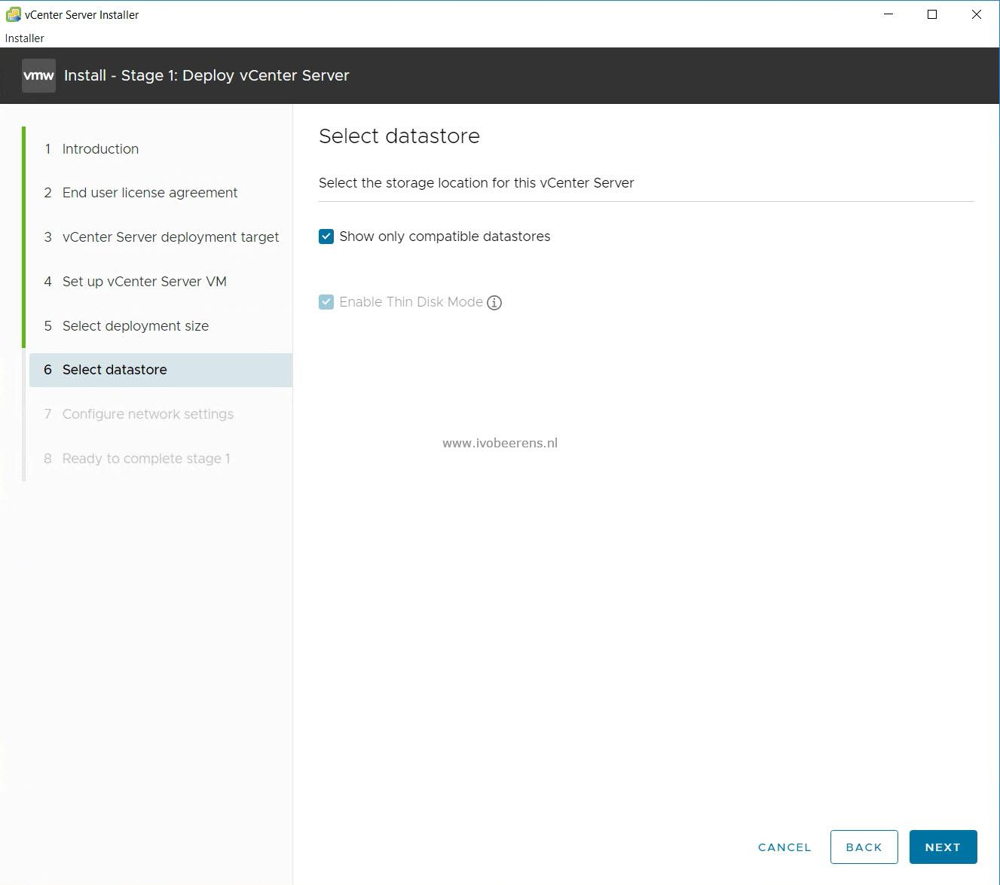

The datastore selection was blank as shown in the following image.

  

 

After googling I found the solution on a blog from another vExpert ([link](https://arabitnetwork.com/2019/03/10/vcsa-6-5-6-7-ui-installer-opens-a-blank-page/)) who experience this issue with VCSA 6.5/6.7 installers. So the issue still exists in the vCenter Server 7 UI installer.

Here are the steps to solve this:

- Go to the %appdata% folder (it opens the C:\\Users\\<username>\\AppData\\Roaming folder)
- Delete the installer folder.
- Run the VCSA installer again and you see the datastores again

