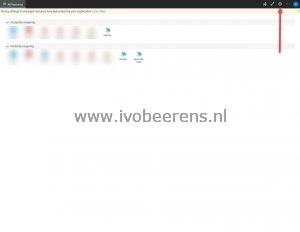
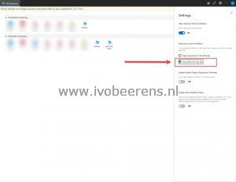

**1**. Log in using the AVD WebClient using the following URL: https://client.wvd.microsoft.com/arm/webclient/index.html

**2**. In the right corner click on the Settings wheel

**3.** Select in "Resources Launch Method" section for "Download the rdp file"

**4.** Close the screen by clicking on the **X** mark

**5.** Click on the remote app or desktop to download the RDPW file

