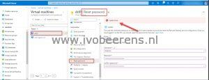
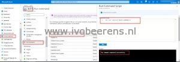
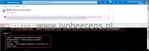

 

The password reset update failed. The password reset option uses a VM Access extension. When digging into the activity log I found the following error:

> VMAccess Extension does not support Domain Controller

So I went to another approach using the following steps:

**Prerequisites:**

- Ensure the VM status is running
- Create a new password
    - Portal - between 12 - 123 characters
    - PowerShell - between 8 - 123 characters
    - CLI - between 12 - 123
    - Have lower characters
    - Have upper characters
    - Have a digit
    - Have a special character (Regex match \[\\W\_\])

## Using the Azure portal

- - Log in to the Azure portal
    - Navigate to the Virtual Machine that you want to reset the password for.
    - Select the Virtual Machine
    - Select Run Command
    - Select RunPowerShellScript
    - In the "Run Command Script" window enter:

\[code language="text"\] net user <username> <password> \[/code\]

 

## Using Cloud Shell

- Log in to the Azure portal
- In the Azure Portal open Cloud Shell
- Select Bash
- In the following command change: <vm> <resource group the vm belongs > <username> and <password>

\[code language="text"\] az vm run-command invoke --command-id RunPowerShellScript --name <vm> -g <resource group the VM belongs too> --scripts "net user <username> <password>" \[/code\]

 

 

Using the RunPowerShellScript is a lifesaver when you forgot the password of a Windows Domain Controller VM in Azure. This procedure works also for regular Windows VMs.

