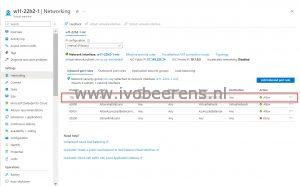
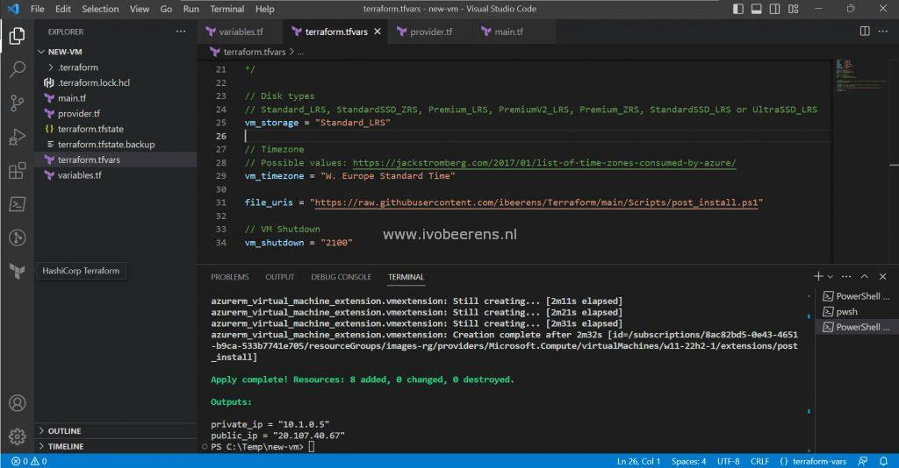

In this example, an Azure VM is created using existing Azure resources (Resource Group, VNet, and Subnet) with the following settings:

- A Windows Server 2022 or Windows 11 22H2 Enterprise multi-session VM with the options trusted launch, secure boot, and vTPM enabled
- The VM has a public and private IP address or only a private IP address
- When defining a public IP address, a Network Security Group (NSG) is created with an RDP rule that only allows the external IP address
- A Custom Script Extension that downloads and executes a PowerShell script
- Automatically Shutdown the VM at a given time

After the test completes, the VM is destroyed by Terraform. When creating images (golden images) I use other tools such as Hashicorp Packer for example.

## File structure

In the Terraform file structure, the following files are created:

**terraform.tfvars -** The values of the variables are defined in this file. This is the only file that's needed to be modified. **variables.tf -** Contains all the defined variables. **provider.tf -** Contains the Azure Cloud provider Terraform communicates with. **main.tf -** This is the main configuration file for creating the VM

In an existing environment, we already have resources that are not managed by Terraform as part of the deployment. In the **terraform.tfvars** file we can define the names of the existing resources the VM is going to use such as:

- Resource Group
- Region
- The VNET
- The Subnet

## terraform.tfvars

In the **terraform.tfvars**, all the values of the variables are defined. I use comments (single line) and comment blocks with the following syntax:

\[code language="PowerShell"\] Single line begin with: // Multiple lines: begins with: /\* and ends with \*/ \[/code\]

The comment blocks are used for excluding multiple lines from the Terraform files.

**vm\_name -** The name of the VM **vm\_rg -** An existing Resource Group where the VM resources will be created **vnet\_rg -** An existing VNet resource group **vnet\_name -** An existing VNet name **vm\_size -** VM type **vm\_username -** Local Administrator username **tag\_environment -** Environment tag

**Operating System**

Windows Server 2022 and Windows 11 22H2 Enterprise multi-session with trusted launch, secure boot, and vTPM enabled are defined. Select one OS.

Windows 11 22H2 Enterprise Multi-Session

\[code language="PowerShell"\] offer = "Windows-11" publisher = "microsoftwindowsdesktop" sku = "win11-22h2-avd" \[/code\]

Windows Server 2022

\[code language="PowerShell"\] offer = "windowsserver" publisher = "microsoftwindowsserver" sku = "2022-datacenter-azure-edition" \[/code\]

**vm\_storage -** Type of storage used **vm\_timezone -** Which Timezone is used **file\_uris -** File location of the Custom Script Extension **vm\_shutdown -** VM shutdown time

Change the values to your needs.

## Private/Public IP address

When deploying  VMs it is not recommended to give them a public IP address because everyone can connect to the VM from outside the network.  But without a VPN connection, you need a public IP for connecting the VM by RDP for example. When deploying a VM with a public IP address make sure to create a Network Security Group (NSG) with an RDP rule that only allows the public IP access to the VM. The cool thing is that the public IP is not hardcoded in the script. A service called https://api.ipify.org will get the public IP address.

Public IP address

If you have a VPN connection a private IP is sufficient. The following lines can be excluded:

\[code language="PowerShell"\] // Not needed when using a VPN or Bastion public\_ip\_address\_id = azurerm\_public\_ip.public\_ip.id \[/code\]

**and the RDP rule:**

\[code language="PowerShell"\] // Not needed when using a VPN or Bastion // NSG Security RDP rule(s) resource "azurerm\_network\_security\_rule" "vm-sec-rule" { access = "Allow" destination\_address\_prefix = "\*" destination\_port\_range = "3389" direction = "Inbound" name = "RDP" network\_security\_group\_name = azurerm\_network\_security\_group.vm-nsg.name priority = 100 protocol = "Tcp" resource\_group\_name = data.azurerm\_resource\_group.vm-rg.name source\_address\_prefixes = local.authorized\_ip\_ranges source\_port\_range = "\*" depends\_on = \[ azurerm\_network\_security\_group.vm-nsg, \] } \[/code\]

## Custom Script Extension

The azurerm\_virtual\_machine\_extension resource, downloads and run a script in the VM as a post-deployment task. As a location, I use my own GitHub repository. In the repository is a PowerShell script that performs the following post-deployment tasks:

- Allow ICMP ping requests to the VM
- Set the Power Management profile to "High Performance"
- Create a c:\\temp folder
- Set the OS label to OperatingSystem
- Install the Chocolatey package manager
- Install Visual Studio Code
- Install NotePad++

## Automatically shutdown

With the azurerm\_dev\_test\_global\_vm\_shutdown\_schedule resource, you can control the shutdown time of the VM. This can be useful if you want to stop (deallocated) the VM to save costs. In the **terraform.tfvars** file, you set the **vm\_shutdown** value.

## Create the VM

To run Terraform, execute step 1 till 3 found here: [link](https://github.com/ibeerens/Terraform/blob/main/README.md)

First, initialize terraform which downloads the Terraform provider(s) defined:

\[code language="PowerShell"\] terraform init \[/code\]

The password is not hardcoded in the **terraform.tfvars** file. With the Terraform apply command you can set the password for the variable "vm\_password". The apply option creates a plan and executes this.  The **--auto-approve** option doesn't ask for confirmation to apply changes:

\[code language="PowerShell"\] terraform apply -var "vm\_password=ThisisaGoodPassword!" --auto-approve \[/code\]

After a couple of minutes, the VM is created and the private and public IP addresses are displayed as output values.

## Destroying the Windows VM

When finishing with testing the  VM can be destroyed without destroying the existing resources such as:

- Resource Group
- The VNet
- The Subnet

The following command destroys the VM just created:

\[code language="PowerShell"\] terraform destroy -var "vm\_password=ThisisaGoodPassword!" --auto-approve \[/code\]

## Conclusion

This example shows one of the strengths of Terraform. You only need to change a single file (**terraform.tfvars**) once that includes the values of the variables. With a single command, you create a VM in a couple of minutes, and with a single command, you destroy the VM with all the resources you created. Very powerful!

The GitHub repository can be found here: [Link](https://github.com/ibeerens/Terraform/tree/main/New-VM)

