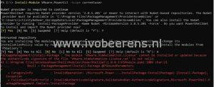
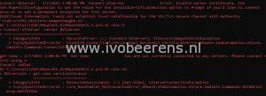

On a new Windows Server 2022 VM I tried to install a fresh copy of VMware.PowerCLI (13.0.0) with the following PowerShell command:

```powershell
Install-Module VMware.PowerCLI -Scope CurrentUser
```
The following error occurred:

> PackageManagement\\Install-Package : The module 'VMware.VimAutomation.License' cannot be installed or updated because the authenticode signature of the file 'VMware.VimAutomation.License.cat' is not valid. At C:\\Program Files\\WindowsPowerShell\\Modules\\PowerShellGet\\1.0.0.1\\PSModule.psm1:1809 char:21 + ... $null = PackageManagement\\Install-Package @PSBoundParameters + ~~~~~~~~~~~~~~~~~~~~~~~~~~~~~~~~~~~~~~~~~~~~~~~~~~~~ + CategoryInfo : InvalidOperation: (Microsoft.Power....InstallPackage:InstallPackage) \[Install-Package\], Exception + FullyQualifiedErrorId : InvalidAuthenticodeSignature,ValidateAndGet-AuthenticodeSignature,Microsoft.PowerShell.P ackageManagement.Cmdlets.InstallPackage

[](images/1.jpg)

Using the -Force and -SkipPublisherCheck options fixed the error. The command to execute is:
```powershell
Install-Module VMware.PowerCLI -Scope CurrentUser -Force -SkipPublisherCheck -AllowClobber
```

For existing installations, you can first remove PowerCLI and then install PowerCLI again:
```powershell
 Get-InstalledModule VMware.PowerCLI | Uninstall-Module -Force 
 Install-Module VMware.PowerCLI -Scope CurrentUser -Force -SkipPublisherCheck -AllowClobber
 ```

After the PowerCLI modules installation finishes you can run the following command to check what version is installed:
```powershell
Get-InstalledModule VMware.PowerCLI | Select Name, Version
```

[](images/3.jpg)

### Certificate error

When trying to connect to the vCenter Server you've got the following error:

> Invalid server certificate. Use Set-PowerCLIConfiguration to set the value for the InvalidCertificateAction option to Prompt if you'd like to connect once or to add a permanent exception for this server.

[](images/invalid-cert.jpg)

I had no trusted certificate installed. The following command ignores invalid certificates and suppresses the VMware Customer Experience Improvement Program:
```powershell
Set-PowerCLIConfiguration -InvalidCertificateAction Ignore -Confirm:$false -ParticipateInCeip $false
```

Now I was able to connect to vCenter Server with PowerCLI.