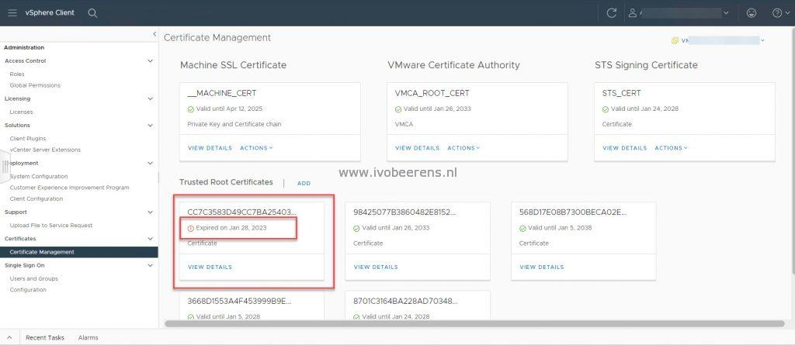

Cleaning up expired root certificates from the vCenter Server can be done by using the "vecs-cli" command on the vCenter Server Appliance (In the vSphere Client this is not possible). This involves multiple steps ([VMware KB](https://kb.VMware.com/s/article/2146011)). An easy way to clean up expired root certificates is by using PowerCLI and following the steps below:

- Make sure that PowerCLI is installed. If not use the following command in PowerShell to install PowerCLI:

\[code language="PowerShell"\] Install-Module VMware.PowerCLI -Scope CurrentUser -Force -SkipPublisherCheck -AllowClobber \[/code\]

- Connect to the vCenter Server

\[code language="PowerShell"\] Connect-VIServer "VCENTER-FQDN" \[/code\]

- List the expired root certificate

\[code language="PowerShell"\] Get-VITrustedCertificate -vCenterOnly | Where-Object { $\_.NotValidAfter -lt (Get-Date) } \[/code\]

- Remove the expired root certificate

\[code language="PowerShell"\] Get-VITrustedCertificate -vCenterOnly | Where-Object { $\_.NotValidAfter -lt (Get-Date) } | Remove-VITrustedCertificate \[/code\]

With the latest PowerCLI oneliner, all the expired root certificates are removed from the VCSA. This is less complex than using the "vecs-cli" command.

