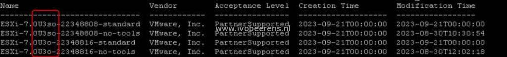

When installing a patch on a VMware ESXi host using the ESXCLI command you need to specify the image profile that is available in the ESXi patch.

Here are the steps for patching a VMware ESXi host with the correct image profile:

- Go to the [Customer Connect Patch Downloads page.](https://my.vmware.com/group/vmware/patch#search)
- Download the patch needed, In this example, I use ESXi patch **VMware-ESXi-7.0U3o-22348816-depot.zip**
- Upload the patch to a datastore
- Make a SSH connection to the ESXi host
- Place the host in maintenance mode

esxcli system maintenanceMode set –enable-true

- Now you need to know which image profiles are available in the VMware ESXi patch. To do this use the following command (replace the **<datastore>** with your datastore):

esxcli software sources profile list -d /vmfs/volumes/<datastore>/iso/VMware-ESXi-7.0U3o-22348816-depot.zip

- The following profiles are listed. As you can see the image profile contains 4 image profiles:

- Here is a table with so, 0, standard, and no-tools means:

<table style="border-collapse: collapse; width: 100%; height: 120px;"><tbody><tr style="height: 24px;"><td style="width: 50%; height: 24px;"><strong>Option</strong></td><td style="width: 50%; height: 24px;"><strong>Details</strong></td></tr><tr style="height: 24px;"><td style="width: 50%; height: 24px;">standard</td><td style="width: 50%; height: 24px;">With VMware Tools included</td></tr><tr style="height: 24px;"><td style="width: 50%; height: 24px;">no-tools</td><td style="width: 50%; height: 24px;">Without VMware Tools</td></tr><tr style="height: 24px;"><td style="width: 50%; height: 24px;">so</td><td style="width: 50%; height: 24px;">Security updates only image</td></tr><tr style="height: 24px;"><td style="width: 50%; height: 24px;">o</td><td style="width: 50%; height: 24px;">Security and Bugfix update image</td></tr></tbody></table>

- To install the ESXi with security and bugfix updates without VMware Tools use the following command (replace the **<datastore>** with your datastore):

esxcli software profile update -d /vmfs/volumes/<datastore>/VMware-ESXi-7.0U3o-22348816-depot.zip -p ESXi-7.0U3o-22348816-no-tools

- Reboot the host

esxcli system shutdown reboot -r "Patch ESXi 7.0U3"

- When the host is back, exit maintenance mode,  make a SSH connection to the ESXi host

esxcli system maintenanceMode set --enable false

With this procedure, you can specify the right image profile when manually patching an ESXi host.
