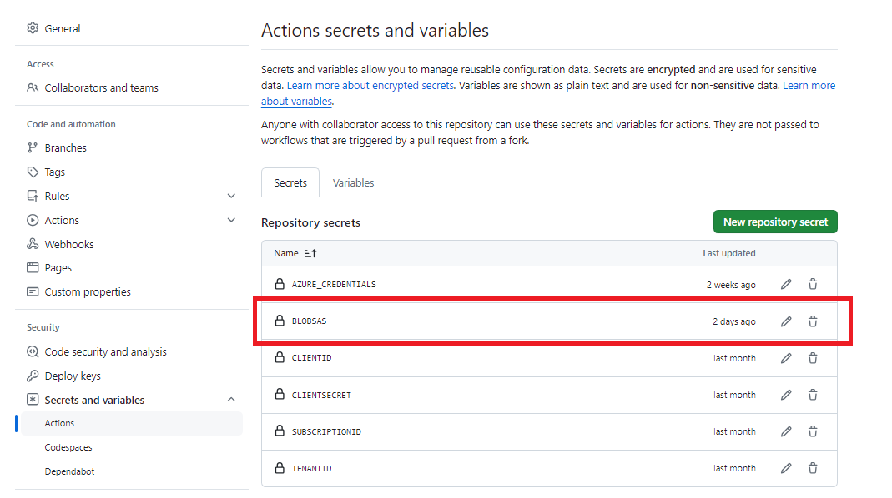

GitHub Action 
Packer
Create a VM
Download software from a Azure Storage Blob Account. To grant access to the blob I use the SAS URL and token that is passed from GitHub to Packer as secret.

With Packer I create a Windows VM.
In a Azure Blob Storage container I store applications that will be uploaded to the VM. 

Pass GitHub variable to Packer PowerShell script

A shared access signature (SAS) is a URI that grants restricted access rights to Azure Storage resources. You can provide a shared access signature to clients who should not be trusted with your storage account key but whom you wish to delegate access to certain storage account resources. By distributing a shared access signature URI to these clients, you grant them access to a resource for a specified period of time.

A shared access signature (SAS) is a URI that grants restricted access rights to Azure Storage resources. You can provide a shared access signature to clients who should not be trusted with your storage account key but whom you wish to delegate access to certain storage account resources. By distributing a shared access signature URI to these clients, you grant them access to a resource for a specified period of time.
An account-level SAS can delegate access to multiple storage services (i.e. blob, file, queue, table). Note that stored access policies are currently not supported for an account-level SAS.

```
https://ibeerens1234.blob.core.windows.net/
?sv=2022-11-02&ss=b&srt=sco&sp=rwdlaciytfx&se=2024-05-25T19:30:13Z&st=2024-05-25T11:30:13Z&spr=https&sig=
```




As Packer GitHub Action I use the following action [Setup HashiCorp Packer`
](https://github.com/marketplace/actions/setup-hashicorp-packer)


Packer will read environment variables in the form of `PKR_VAR_name` to find the value for a variable. 

```yaml
jobs:
  packer:
    runs-on: self-hosted
    name: Run Packer
    steps:
      - name: Checkout
        uses: actions/checkout@v4
      - name: Setup `packer`
        uses: hashicorp/setup-packer@main
        id: setup
        with:
          version: ${{ env.PRODUCT_VERSION }}
      - name: Run `packer init`
        id: init
        run: "packer init ./packer/windows11.json.pkr.hcl"
      - name: Run `packer build`
        id: build
        run: "packer build -force -var-file='./packer/variables.pkr.hcl' -var 'client_id=${{ secrets.CLIENTID }}' -var 'client_secret= ${{ secrets.CLIENTSECRET }}' -var 'subscription_id=${{ secrets.SUBSCRIPTIONID }}' -var 'tenant_id=${{ secrets.TENANTID }}' -var 'PKR_VAR_blobsas=${{ secrets.BLOBSAS }}' './packer/windows11.json.pkr.hcl'"
```

Within Packer

```
variable "PKR_VAR_blobsas" {
  type    = string
}
```

[environment_vars](https://developer.hashicorp.com/packer/docs/provisioners/powershell#environment_vars)


  provisioner "powershell" {
    environment_vars = ["saskey=${var.PKR_VAR_blobsas}"]
    script = "./packer/scripts/105_DownloadAzcopy.ps1"
  }


# Download from Blob storage
```
.\azcopy.exe cp $Env:saskey "c:\install\" --recursive
```


